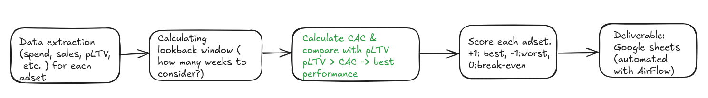

# CAC vs pLTV Adset Scoring (Weekly Budget Steering)

A weekly decision system to **pause/scale adsets** across Meta, TikTok, and Google (Brand/Non-Brand/PMAX) by comparing **client-provided predicted LTV (pLTV)** against a statistically robust **CAC** estimate.

**Scale & impact**
- ~**500–1000 adsets** scored weekly → rolled up to ~**200 campaigns**
- Used by channel owners to steer weekly spend and **monthly budget allocation**
- Contributed to ~**20% ROI improvement** and a steady rise in the pLTV/CAC ratio
- Maintained **>95% spend coverage** after filtering (typically **~98%**)

---

## Why this is needed
Adset-level attribution is often **sparse/noisy**. Naive CAC estimates can explode (tiny denominators) or lag decisions (too long windows).  
This pipeline balances **recency** and **signal strength** while staying explainable.

---

## Method
1. **Preprocess** weekly adset data and align weeks (fill missing weeks)
2. **Attribution correction:** apply a per-channel uplift factor to create `redistributed_ihc`
3. **Pre-filters:** keep only adsets with recent spend + minimal engagement signal
4. **Dynamic lookback (3–8w):** pick the smallest recent window with enough signal
5. **CAC estimate:** LB CAC or **Binomial “optimistic CAC”** fallback (beta/Clopper-Pearson upper bound)
6. **Score & rank:** distance from break-even line **pLTV = CAC**
7. **Rollups:** adset → campaign → channel
8. **Deliver:** Google Sheet + summary doc + Slack update (weekly)

---

## Pipeline overview

---

## Read more
- Full write-up: **[`docs/case-study.md`](docs/case-study.md)**
- Core logic snippets (sanitized): **[`snippets/core-logic.md`](snippets/core-logic.md)**

---

## Notes on confidentiality
This is a **case study**. Snippets focus on methodology; no proprietary identifiers, credentials, or client data are included.
